<div align="center">

# PAVEN: A Perceptual Algorithm for Versatile video Encoding using Neural networks

[](https://doi.org/10.1016/j.engappai.2025.111664)
[](https://oa.upm.es/88254/)
[](https://huggingface.co/lagosproject/paven)
[]()
[]()
[](https://opensource.org/licenses/MIT)

</div>

---

Official open-source implementation and evaluation framework for **PAVEN** (*A Perceptual Algorithm for Versatile video Encoding using Neural networks*), published in Elsevier's *Engineering Applications of Artificial Intelligence* (EAAI), 2025, and developed at Universidad Politécnica de Madrid (UPM).

PAVEN leverages deep spatio-temporal visual attention networks to model human foveal fixation and transitional saccadic eye movements over video sequences. By mapping continuous visual saliency distributions into discrete Coding Tree Unit (CTU, $128 \times 128$) quantization deltas, PAVEN achieves between **3% and 16% bitrate reduction** in Versatile Video Coding (VVC/H.266) without any perceived loss in subjective visual quality.

---

## 🌟 Key Features

- **Decoupled Delta-QP Contract:** Outputs standard `.qp` matrices ($\Delta QP \in \{0, +4, +8\}$) independent of base QP values, seamlessly consumable by any compliant video codec (VTM, HM, x265, SVT-AV1).
- **Luminance Replicating Architecture (`YYY`):** Bypasses chrominance distortion in deep CNNs by mapping $Y \rightarrow YYY$, restoring feature extraction fidelity to near-RGB levels (+30–50% top-1 accuracy over raw YUV).
- **Hugging Face Hub Integration:** One-line automatic download and caching of pre-trained model weights (`PavenModel.from_pretrained("lagosproject/paven")`).
- **High-Performance Streaming YUV Loader:** Memory-efficient, generator-based reader for 8-bit and 10-bit raw planar YUV420p streams.
- **HPC Training Reproducibility:** Includes complete PyTorch training loops, multi-objective perceptual loss metrics (KLD, CC, SIM), and SLURM execution scripts configured for NVIDIA A100 GPU clusters.

---

## 📐 Algorithmic Overview

```mermaid
flowchart LR
    subgraph INPUT["1. Input Video Stream"]
        RAW["Raw Planar YUV420p (8/10-bit)"] --> YYY["Luma Extraction & Replicating (Y -> YYY)"]
    end

    subgraph NET["2. Spatio-Temporal Saliency Prediction"]
        YYY --> S3D["Backbone S3D (Separable 3D Inception)"]
        S3D --> ATTN["Multi-Layer Temporal Attention Decoders"]
        ATTN --> SAL["Continuous 2D Saliency Density Map [0, 1]"]
    end

    subgraph GRID["3. Perceptual Quantization (QpGrid)"]
        SAL --> GAUSS["Gaussian Smoothing (k=11)"]
        GAUSS --> HULL["Convex Hull (Saccadic Transition Area)"]
        HULL --> CTU["128x128 CTU Grid Decomposition"]
        CTU --> L1["Level 1 (ΔQP = 0): Foveal Center"]
        L1 --> L2["Level 2 (ΔQP = +4): 2-Repetition Morphological Dilation"]
        L2 --> L3["Level 3 (ΔQP = +8): Peripheral Background"]
    end

    subgraph OUT["4. Standardized Output"]
        L1 & L2 & L3 --> QP[".qp Delta-QP File (Line per POC, Raster CTU Order)"]
    end

    QP -.->|"Injected via CTU Delta"| CODEC["Video Encoder (VTM / HM / x265)"]
```



---

## 🚀 Quickstart Guide

### 1. Installation

Install the package directly in editable mode:
```bash
git clone https://github.com/lagosproject/paven.git
cd paven
pip install -e .
```

### 2. Python API

```python
import torch
from paven import PavenModel, YUVReader, QpGrid

# Load pre-trained model directly from Hugging Face Hub
model = PavenModel.from_pretrained("lagosproject/paven")
model.eval()

# Stream a 1080p raw YUV420 video
reader = YUVReader("sample_1080p.yuv", width=1920, height=1080)
clip_tensor = reader.get_clip_tensor(start_frame=0, clip_len=32, to_yyy=True)

# Predict frame visual saliency
with torch.no_grad():
    saliency_map = model(clip_tensor)

# Generate 128x128 CTU Delta-QP grid
qp_gen = QpGrid(img_size=(1920, 1080))
delta_qp_matrix = qp_gen.compute_frame_grid(saliency_map.squeeze().cpu().numpy())
print("CTU Delta-QP Grid (9x15):\n", delta_qp_matrix)
```

### 3. Command Line Interface (CLI)

Generate a `.qp` matrix with a single command:
```bash
paven-generate \
    --video input_1080p.yuv \
    --output delta_matrix.qp \
    --width 1920 \
    --height 1080 \
    --fps 30
```

---

## 📊 Experimental Results

Across 20 standard high-definition and 4K JVET Common Test Condition (CTC) sequences, PAVEN achieves significant bitrate reduction while maintaining identical subjective scores:

| Metric | Base QP 27 | Base QP 37 |
| :--- | :---: | :---: |
| **Average Bitrate Reduction (%)** | **7.31%** | **6.84%** |
| **Maximum Bitrate Reduction (%)** | **16.16%** | **14.92%** |
| **Median Bitrate Reduction (%)** | **6.46%** | **6.15%** |
| **Subjective Quality Loss (DSCQS)** | **None (0%)** | **None (0%)** |

---

## 📁 Repository Structure

```
lagosproject/paven/
├── paven/                         # Core installable Python package
│   ├── model.py                   # S3D backbone + ViNet architecture + HF Hub loader
│   ├── model_utils.py             # 3D separable convolutions and Inception blocks
│   ├── qp_grid.py                 # QpGrid 3-level perceptual quantization (TFM Cap. 5)
│   ├── yuv_loader.py              # High-performance streaming YUV420p reader
│   ├── loss.py                    # Multi-objective saliency metrics (KLD, CC, SIM, NSS)
│   └── cli.py                     # CLI entrypoint: 'paven-generate'
├── training/                      # Complete HPC training pipeline (CeSViMa Magerit)
│   ├── train.py                   # PyTorch training loop
│   ├── dataloader.py              # PyTorch Dataset for 13 visual attention benchmarks
│   ├── loss.py                    # Multi-objective loss formulation
│   └── train_slurm.sh             # SLURM submission script for NVIDIA A100 GPU clusters
├── configs/sequences/             # Standard JVET CTC video sequence metadata (.cfg)
├── tools/                         # Evaluation, preprocessing, and codec execution utilities
│   ├── bitrate_analysis/          # Bitrate reduction and LaTeX table generation
│   ├── codec_runners/             # Codec execution utilities & reference patches
│   │   ├── vtm_paven/             # Official VTM 18.2 patch (399 lines) & 1-click build script
│   │   └── generate_vtm_jobs.py   # Automated VTM / VVC SLURM batch job generators
│   ├── dataset_preparation/       # KDE estimation, resizing, and dataset acquisition
│   │   ├── matlab/                # Full MATLAB Gaussian fixation mask generators (LEDOV, HVEC)
│   │   ├── resize_dataset_parallel.py # Multithreaded dataset resizer with resume logs
│   │   ├── video_fusion_overlay.py    # Saliency JET colormap overlay on RGB frames
│   │   └── video_splitter.py          # Video-to-frame splitter
│   ├── matlab_evaluation/         # Official DHF1K & MIT benchmark metric suite (CC, SIM, NSS, AUC)
│   │   ├── HVECTest.m             # Test sequence benchmark runner
│   │   ├── evaluationFuncHVEC.m   # Frame-by-frame evaluator
│   │   └── FastEMD/               # Earth Mover's Distance MEX computation
│   ├── visualization/             # Multi-panel 4K comparison video generator
│   └── yuv_utils/                 # FFmpeg YUV <-> MP4 converters
├── experiments/color_spaces/      # Empirical study on YYY vs YUV representations
├── tests/                         # Automated pytest test suite (8 unit tests)
├── docs/                          # Comprehensive research documentation
│   ├── delta_qp_specification.md  # Formal mathematical specification of .qp files
│   ├── codec_integration.md       # Integration guide for VTM, HM, x265, and SVT-AV1
│   ├── training_guide.md          # Full HPC replication walkthrough
│   ├── datasets.md                # 13 dataset catalog and acquisition links
│   └── paper_citation.md          # BibTeX and APA citations
├── pyproject.toml                 # Modern PEP 517/621 packaging metadata
├── requirements.txt               # Pinned dependencies
├── CITATION.cff                   # Native GitHub citation format
├── LICENSE                        # MIT License
└── README.md                      # Primary project documentation
```

---

## 📚 Citation

```bibtex
@article{DIAZHONRUBIA2025111664,
  title   = {PAVEN: A Perceptual Algorithm for Versatile video Encoding using Neural networks},
  journal = {Engineering Applications of Artificial Intelligence},
  volume  = {159},
  pages   = {111664},
  year    = {2025},
  issn    = {0952-1976},
  doi     = {https://doi.org/10.1016/j.engappai.2025.111664},
  author  = {Antonio Jesús Díaz-Honrubia and Pablo Fernández-Lagos and Roberto Valle and Jesús Bescós}
}

@mastersthesis{FernandezLagos2025TFM,
  author  = {Pablo Fernández Lagos},
  title   = {Codificación Perceptual de Vídeos en el Estándar VVC Usando Técnicas Basadas en el Aprendizaje Profundo},
  school  = {Escuela Técnica Superior de Ingenieros Informáticos, Universidad Politécnica de Madrid},
  year    = {2025},
  month   = {January},
  url     = {https://oa.upm.es/88254/}
}
```

> [!NOTE]
> **Institutional Repository Reference (MEDAL / CTB-UPM):**  
> The paper published in *Elsevier EAAI 2025* references the institutional development repository at [`https://medal.ctb.upm.es/internal/gitlab/adiaz/paven/`](https://medal.ctb.upm.es/internal/gitlab/adiaz/paven/) hosted by the Medical Data Analysis Laboratory (MEDAL) at the Center for Biomedical Technology (CTB), Universidad Politécnica de Madrid (UPM). This GitHub repository ([`lagosproject/paven`](https://github.com/lagosproject/paven)) is the official, publicly accessible standalone release containing the pip-installable Python package, Hugging Face model integration, CLI utilities, and reproducible benchmark suites.

---

## 🤝 Acknowledgments

The spatio-temporal video saliency backbone of PAVEN is adapted and extended from the [ViNet](https://github.com/samyak0210/ViNet) architecture by Samyak Jain et al. Computational resources were provided by the **CeSViMa Supercomputing Center (Magerit)** at Universidad Politécnica de Madrid. Research and development were conducted within the **Medical Data Analysis Laboratory (MEDAL)** at the **Center for Biomedical Technology (CTB)** and the **Grupo de Tratamiento de Imágenes (GTI)** at ETSI Informáticos, UPM.

