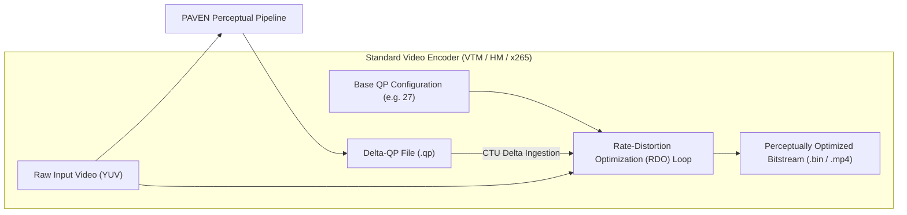

# Integration Guide: Connecting PAVEN Delta-QP Matrices to Modern Video Encoders

This guide outlines the conceptual and algorithmic integration of PAVEN Delta-QP matrices into modern video coding reference software and production encoders (such as VVC/VTM, HEVC/HM, x265, and SVT-AV1).

---

## 1. High-Level Architecture



---

## 2. Ingestion in VVC Reference Software (VTM)

In standard VTM (Versatile Video Coding Test Model, e.g. VTM 18.x / 20.x), CTU-level quantization is evaluated during the recursive Coding Unit (CU) partitioning search within `EncCu.cpp`.

### Required Encoder Configuration
Add configuration flags to `EncAppCfg`:
- `--WidthCUCount`: Number of horizontal CTUs (`ceil(width / 128)`).
- `--qp_file`: Filepath to the external `.qp` configuration matrix.

### Memory Data Structure
In `EncApp.h` / `EncLib.h`, allocate a 2D integer array to store frame-level deltas:
```cpp
int** m_qp_matrix_values; // Dimension: [Total_Frames][CTU_Count_Per_Frame]
```

### Ingestion in `EncCu::compressCtu`
When iterating through candidate coding modes for a CTU at pixel coordinates `(uiLPelX, uiTPelY)`:
```cpp
int val_x = uiLPelX / 128;
int val_y = uiTPelY / 128;
int ctu_index = val_x + val_y * m_pcEncCfg->getWidthCUCount();
int poc = slice.getPOC();

// Retrieve delta and compute final target QP
int delta_qp = m_pcEncCfg->getQPMatrixValues()[poc][ctu_index];
int target_ctu_qp = m_iQP + delta_qp; // Clamped to valid range [0, 63]

// Apply target QP to the current test mode
currTestMode.qp = target_ctu_qp;
```

---

## 3. Ingestion in Production Encoders (x265 / FFmpeg)

In production encoders like `x265` or `x264`, block-level QP offsets can be injected via the **QP-file / Qp-offset** interface or the `libx265` API:

### Method A: Native `--qpfile` Flag
Many encoders support specifying frame types and QP offsets per frame or macroblock via an external text file:
```bash
x265 --input input.yuv --input-res 1920x1080 --fps 30 --qp 27 --qpfile matrix.qp -o output.hevc
```

### Method B: Adaptive Quantization Modulation
For custom pipeline integration, developers can pass the normalized PAVEN saliency density map directly into the encoder's variance-based spatial Adaptive Quantization (AQ) module (`x265_param.rc.aqMode = 3`), scaling local quantization proportionally to $1.0 - \text{Saliency}(x, y)$.

---

## 4. Key Performance Highlights

- **Bitrate Savings:** Delivers between **3% and 16%** bitrate reduction (averaging **7.3%**) across standard JVET Common Test Condition (CTC) sequences at base QPs 27 and 37.
- **Visual Fidelity:** Subjective Double Stimulus Continuous Quality Scale (DSCQS) viewing trials confirmed no perceived quality degradation, as compression is concentrated on non-attended peripheral backgrounds.
